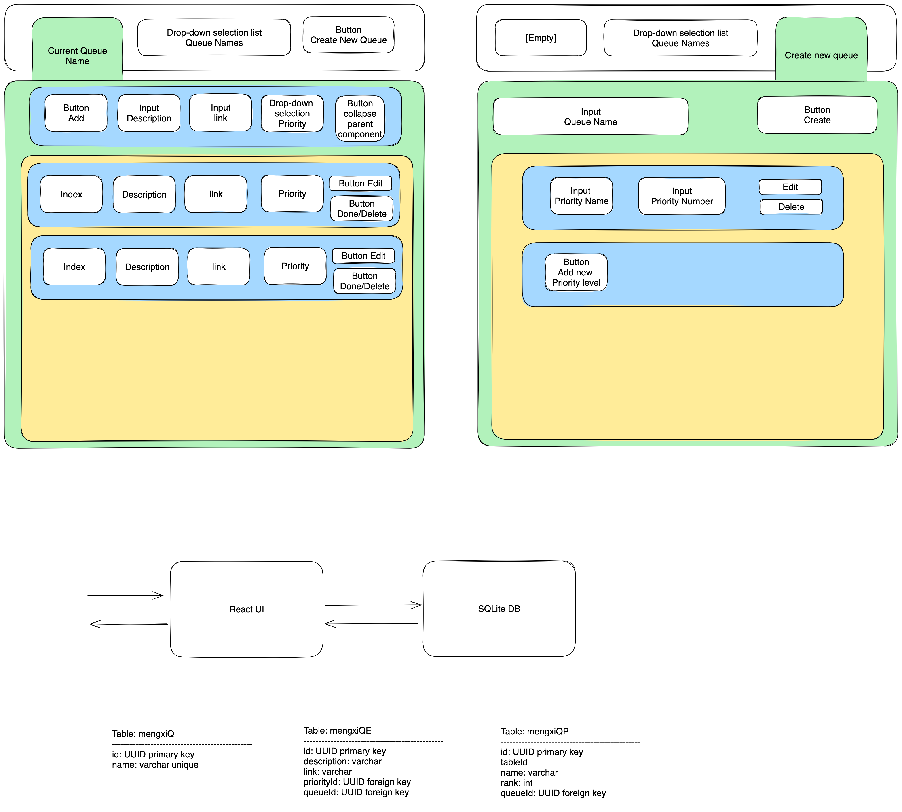

# v1.0.0 Design

## When application start
1. provide UI interface
2. query all queues from DB, provide them as queue name list in the dropdown list

## When create a queue
1. click on the tab
2. when click on create button, write the entry into DB
3. query all queues from DB again and replace the current queue name list in the memory

## When select a queue
1. delete/release the current in-memory priority queue
2. query all queue elements and their relevant priority level
3. sort queue elements order in memory based on their priority rank and keep a priority queue for it

## When add a queue element
1. expand the input fields to allow inputs
2. when click on add button, write the entry into DB
3. create this new element as a memory object and insert into the in-memory priority queue

## UI and DB table design

